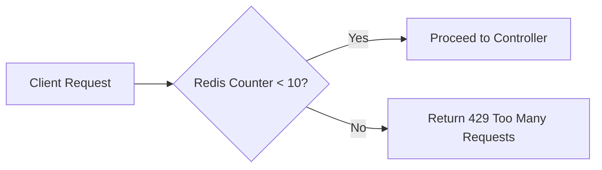
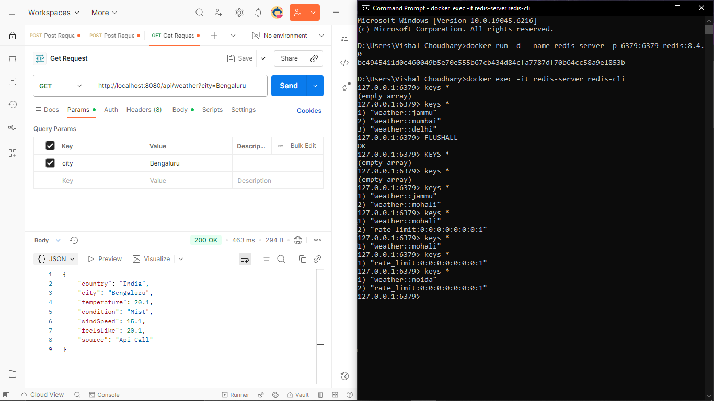
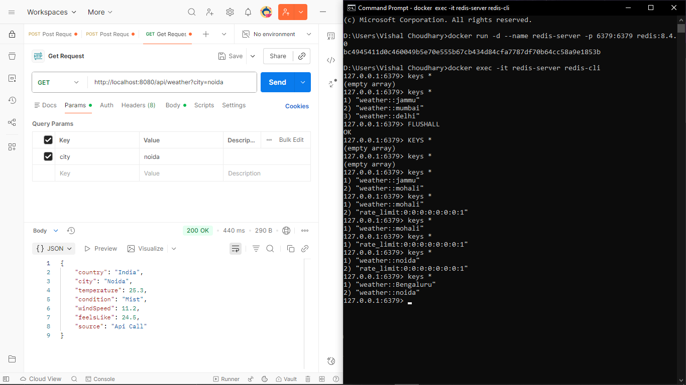
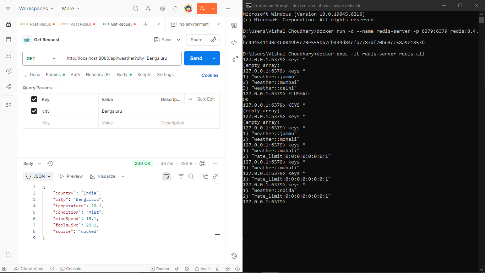
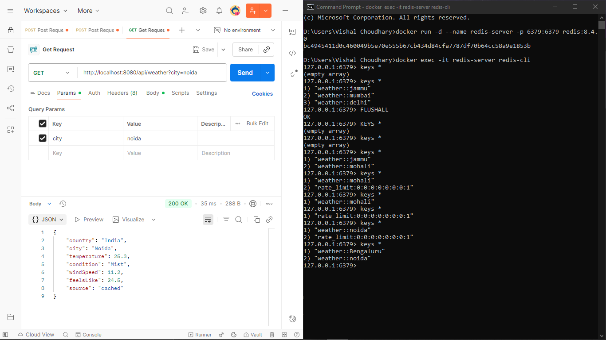
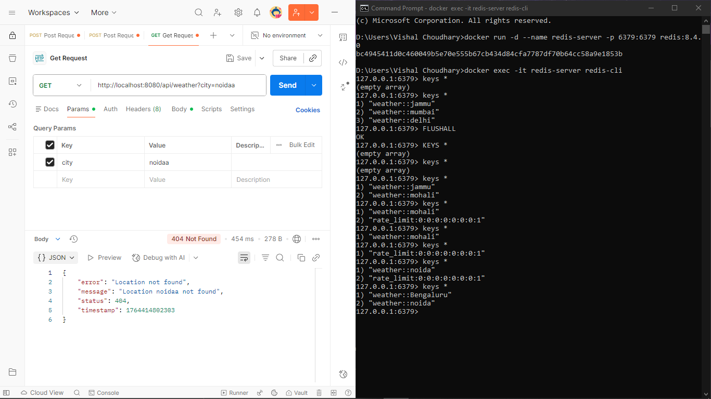
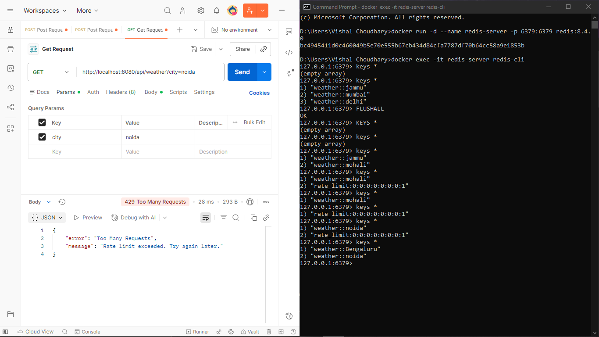
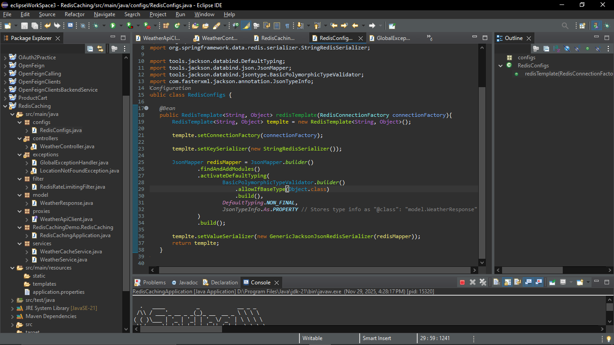
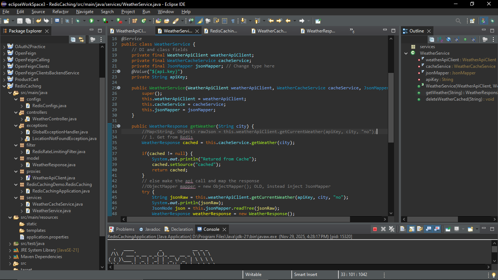

# ⛈️ Spring Boot 4 Advanced Weather API

A high-performance **Weather API Proxy** engineered with **Spring Boot 4** and **Redis**, demonstrating advanced backend architecture patterns such as dual-mapper serialization for secure polymorphic caching and distributed rate limiting.

---

## 🚀 Key Architectural Features

### **1. Dual-Mapper Serialization Strategy (Security)**

**Problem:** Redis requires type metadata (e.g., `@class`) for correct deserialization, but exposing this metadata in API responses is a security risk.

**Solution:** Implemented the **Local Mapper Pattern**:

* **Internal Dirty Mapper (Redis):** Uses `activateDefaultTyping` + `JsonTypeInfo.As.PROPERTY` to store type metadata.
* **External Clean Mapper (API):** Standard Spring Boot mapper without class metadata.

**Result:**

* Cache deserializes cleanly.
* Frontend receives clean, safe JSON.

---

### **2. Distributed Rate Limiting (Fixed Window Algorithm)**

A custom `jakarta.servlet.Filter` protects the API from overuse.

**Mechanism:**

* Client IP is extracted.
* Redis `INCR` increments a counter key: `rate_limit:{ip}`.
* TTL of **60 seconds** is applied on the first request.
* If count > **10**, return **429 Too Many Requests**.

**Why Redis?**
Works across **distributed instances**, making it horizontally scalable.

#### **Rate Limiter Flow**



---

### **3. Spring Boot 4 & Jackson 3 Migration**

* Uses **Spring Boot 4 (Preview)** and modern Jackson 3 (`tools.jackson.databind`).
* Fully migrated from `com.fasterxml.jackson`.

---

## 🛠️ Tech Stack

* **Framework:** Spring Boot 4.0 (Snapshot/Preview)
* **Language:** Java 17+
* **Caching/DB:** Redis (Dockerized)
* **Libraries:** Spring Data Redis, Jackson 3, Lombok
* **Tools:** Maven, Docker, Postman

---

## ⚡ API Flow

### **1. Rate Limiting Filter**

All incoming requests pass through the custom `RedisRateLimitingFilter`.

### **2. Caching Layer (Cache-Aside Pattern)**

* **Cache Hit:** Return cached weather data instantly.
* **Cache Miss:**

  1. Call external Weather API
  2. Serialize with internal mapper
  3. Store in Redis with TTL
  4. Return clean API JSON

---

## ⚙️ Setup & Installation

### **Prerequisites**

* Java 17+
* Maven
* Redis (localhost:6379)

---

### **Step 1: Start Redis**

```bash
docker run -d -p 6379:6379 --name my-redis redis
```

### **Step 2: Clone & Build Project**

```bash
git clone https://github.com/your-username/advanced-redis-weather-api.git
cd advanced-redis-weather-api
mvn clean install
```

### **Step 3: Run Application**

```bash
mvn spring-boot:run
```

---

## 🧪 Testing the Rate Limiter

### **API Request:**

```http
GET http://localhost:8080/weather/London
```

### **Responses (1–10 requests):**

```json
{
  "city": "London",
  "country": "UK",
  "temperature": 15.5,
  "condition": "Cloudy",
  "source": "Api Call"
}
```

### **Response (11+ requests):**

**Status:** 429 Too Many Requests

```json
{
  "error": "Too Many Requests",
  "message": "Rate limit exceeded. Try again later."
}
```

---

## 📂 Project Structure

```
src/main/java
├── configs
│   └── RedisConfigs.java
├── controller
│   └── WeatherController.java
├── filter
│   └── RedisRateLimitingFilter.java
├── model
│   └── WeatherResponse.java
├── services
│   └── WeatherService.java
└── RedisCachingApplication.java
```

---

## 🖼️ Screenshots

(*Images + direct links*)

### API Flow Screens

* 
  **Link:** `images/ApiCall1.png`
* 
  **Link:** `images/ApiCall2.png`

### Cache Screens

* 
  **Link:** `images/Cached1.png`
* 
  **Link:** `images/Cached2.png`

### Error Screens

* 
  **Link:** `images/Notfound.png`
* 
  **Link:** `images/ratelimitexceeded.png`

### Config Screens

* 
  **Link:** `images/redisconfig.png`
* 
  **Link:** `images/servicelayer.png`

### API Flow Screens

* 
* 

### Cache Screens

* 
* 

### Error Screens

* 
* 

### Config Screens

* 
* 

---

## 👨‍💻 Resume Highlights

* Implemented **Cache-Aside pattern** reducing API calls by ~90%.
* Built a **distributed rate limiter** using Redis atomic operations.
* Early adopter of **Spring Boot 4** + **Jackson 3** modernization.

---

*Built with ❤️ by Your Name*
